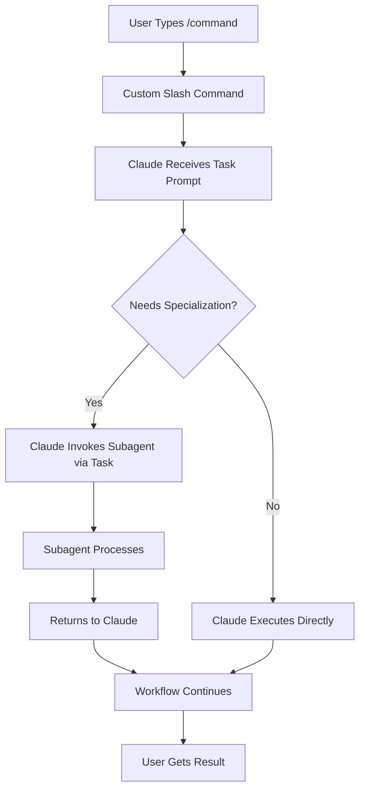

# Custom Slash Commands vs Subagents: Understanding the Distinction

## Key Concepts

### Custom Slash Commands (`/command`)
- **What**: User-accessible workflow initiators in Claude Code's slash menu
- **Purpose**: Define complex task prompts that kickstart specific workflows
- **Access**: Users type `/command` to invoke them
- **Structure**: JSON files that define the command and its task prompt
- **Role**: Orchestrate workflows by providing Claude with structured task instructions

### Subagents
- **What**: Specialized AI assistants with custom system prompts
- **Purpose**: Handle specific domains with focused expertise
- **Access**: Claude invokes them via the Task tool (not directly user-accessible)
- **Structure**: Markdown files with YAML frontmatter in `.claude/agents/`
- **Role**: Execute specialized work when delegated by Claude

## The Relationship



## Workflow Pattern Examples

### Example 1: Security Audit Command
```
/security-audit (Custom Slash Command)
    ↓
Prompt: "Perform comprehensive security audit..."
    ↓
Claude processes and may invoke:
    → security-orchestrator (subagent) for deep analysis
    → bug-issue-creator (subagent) for issue tracking
    → tech-docs-maintainer (subagent) for documentation
```

### Example 2: TDD Development Command
```
/implement-with-tdd (Custom Slash Command)
    ↓
Prompt: "Implement the following using TDD methodology..."
    ↓
Claude processes and may invoke:
    → tdd-python-implementer (subagent) for TDD cycle
    → code-clarity-refactorer (subagent) for cleanup
    → git-diff-documenter (subagent) for documentation
```

## Directory Structure

```
.claude/
├── slash-commands/       # Custom commands (user-facing)
│   ├── security-audit.json
│   ├── implement-tdd.json
│   └── refactor-module.json
│
├── agents/              # Subagents (Claude delegates to these)
│   ├── security-orchestrator.md
│   ├── tdd-python-implementer.md
│   └── code-clarity-refactorer.md
│
└── hooks/              # Automation layer
    └── (hooks that enhance both)
```

## How Hooks Integrate

Hooks can enhance both custom slash commands and subagent execution:

### For Custom Slash Commands
- **UserPromptSubmit**: Can detect slash command patterns
- **PreToolUse**: Prepares context before workflow starts
- **PostToolUse**: Processes results after command execution

### For Subagents
- **PreToolUse (Task)**: Prepares context before subagent invocation
- **SubagentStop**: Processes subagent results
- **Agent Orchestrator**: Chains multiple subagents

## Best Practices

### Custom Slash Commands Should:
1. Define clear, goal-oriented workflows
2. Provide comprehensive task instructions
3. Specify when subagents might be needed
4. Include success criteria

### Subagents Should:
1. Focus on specific expertise domains
2. Have clear, single responsibilities
3. Include detailed system prompts
4. Be reusable across different commands

### Integration Should:
1. Use slash commands as workflow entry points
2. Let Claude decide when to invoke subagents
3. Use hooks to enhance both layers
4. Maintain clear separation of concerns

## Example: Complete Workflow

### Custom Slash Command Definition
```json
{
  "name": "security-audit",
  "description": "Perform comprehensive security audit",
  "prompt": "Conduct a thorough security audit of the codebase. Start by analyzing the current security posture, identify vulnerabilities, create issues for critical findings, and update documentation. Use specialized security analysis tools and subagents as needed."
}
```

### Hook Enhancement
```python
# When /security-audit is triggered:
# 1. prompt-enhancer adds security context
# 2. agent-context-preparer loads security configs
# 3. Claude may invoke security-orchestrator subagent
# 4. agent-result-processor handles findings
# 5. agent-orchestrator chains to bug-issue-creator
```

### Result
User gets comprehensive security audit through:
- Custom command (defines the workflow)
- Claude orchestration (manages execution)
- Subagents (provide specialized expertise)
- Hooks (enhance and automate)

## Mental Model

Think of it as a restaurant:
- **Custom Slash Commands**: The menu items customers order
- **Claude**: The head chef who coordinates everything
- **Subagents**: Specialist chefs (pastry, saucier, etc.)
- **Hooks**: The kitchen prep and quality control

The customer orders from the menu (slash command), the head chef (Claude) orchestrates, calling in specialists (subagents) as needed, while the kitchen systems (hooks) ensure everything runs smoothly.