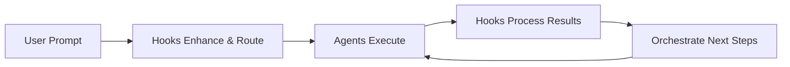

# 🔄 Hook-Command-Subagent Integration System

## Overview

This repository provides a sophisticated integration system where **hooks**, **custom slash commands**, and **subagents** work together to create intelligent, automated workflows in Claude Code. Think of it as giving Claude Code a nervous system (hooks), task initiators (commands), and specialized expertise (subagents) that work in harmony.

## 🎯 Core Concept



### Hooks = Automation & Context
- **Automatic triggers** on Claude Code events
- **Context preparation** for optimal agent performance  
- **Result processing** and workflow orchestration
- **Quality gates** and validation

### Commands = Workflow Initiators
- **User-invoked** task prompts via `/command`
- **Predefined workflows** for common tasks
- **Dynamic arguments** support
- **Context injection** via bash and file references

### Subagents = Specialized Expertise  
- **Focused execution** of specific tasks
- **Deep knowledge** in their domain
- **Clean context** for each invocation
- **Specialized tools** and permissions
- **Invoked by Claude** via Task tool

### Integration = Intelligent Workflows
- **Commands kickstart** workflows
- **Hooks enhance** and route to subagents
- **Subagents execute** specialized tasks
- **Orchestration chains** multiple subagents
- **Context flows** between all components

## 🚀 Quick Start

### Automatic Setup
```bash
# Clone the repository
git clone https://github.com/greyhaven-ai/claude-code-config.git
cd claude-code-config

# Run integrated setup
./setup-integrated-workflow.sh

# Choose workflow preset (1-5)
# Setup complete!
```

### Manual Setup
```bash
# Copy the .claude directory to your project
cp -r /path/to/grey-haven-claude-code-config/.claude /your/project/

# Install integrated settings
cp .claude/templates/settings.integrated.json .claude/settings.local.json

# Make hooks executable
chmod +x .claude/hooks/**/*.{sh,py,js}
```

## 🔧 Key Integration Components

### 1. Subagent Router (`subagent-router.py`)
**Trigger**: UserPromptSubmit  
**Function**: Analyzes prompts and suggests relevant subagents for Claude to invoke
```python
# Example: "I need to implement authentication with tests"
# Suggests: tdd-python-implementer subagent (85% confidence)
#          security-orchestrator subagent (70% confidence)
```

### 2. Context Preparer (`subagent-context-preparer.py`)
**Trigger**: PreToolUse (Task matcher)  
**Function**: Prepares optimal context before subagent execution
```python
# For TDD agent: Detects test framework, finds test directory
# For Security agent: Scans for auth files, security configs
# For Docs agent: Identifies documentation format, existing docs
```

### 3. Result Processor (`subagent-result-processor.py`)
**Trigger**: SubagentStop  
**Function**: Processes subagent outputs and suggests follow-ups
```python
# Security agent finds issues → Suggests bug-issue-creator
# TDD agent adds tests → Suggests code-clarity-refactorer
# Refactor completes → Suggests git-diff-documenter
```

### 4. Workflow Orchestrator (`subagent-orchestrator.py`)
**Trigger**: SubagentStop  
**Function**: Manages multi-subagent workflow chains
```python
# Detects workflow patterns
# Chains agents automatically
# Maintains workflow state
# Ensures completion
```

## 📋 Workflow Examples

### Development Workflow
```
/implement-feature → code-synthesis-analyzer → tdd-python-implementer → code-clarity-refactorer → git-diff-documentation
```

### Security Workflow
```
/security-audit → security-orchestrator → bug-issue-creator → tech-docs-maintainer
```

### Documentation Workflow
```
/update-docs → git-diff-documentation → tech-docs-maintainer → web-docs-researcher
```

### Quality Workflow
```
/improve-quality → code-synthesis-analyzer → code-clarity-refactorer → tdd-python-implementer
```

## 🎨 Integration Patterns

### Pattern 1: Prompt Enhancement + Routing
```yaml
User: "fix the authentication bug"
  ↓
Hooks:
  - prompt-enhancer: Adds error logs, stack trace
  - agent-router: Suggests /security-orchestrator
  ↓
Agent: security-orchestrator (with full context)
  ↓
Result: Comprehensive security fix
```

### Pattern 2: Conditional Workflow Chains
```yaml
Agent: code-synthesis-analyzer
  ↓
Result: {issues_found: true, types: ["quality", "tests"]}
  ↓
Orchestrator:
  - Routes to: code-clarity-refactorer (for quality)
  - Then to: tdd-python-implementer (for tests)
  - Finally: git-diff-documenter (document all changes)
```

### Pattern 3: Quality Gates
```yaml
Edit: modify_auth.py
  ↓
Hooks:
  - security-validator: Check for credentials ✓
  - test-runner: Run auth tests ✓
  - linter: Check code style ✓
  ↓
Continue or Block based on results
```

## 🛠️ Configuration

### Minimal Integration
```json
{
  "hooks": {
    "UserPromptSubmit": [{
      "command": ".claude/hooks/python/agent-router.py"
    }],
    "SubagentStop": [{
      "command": ".claude/hooks/python/agent-result-processor.py"
    }]
  }
}
```

### Full Integration
See `.claude/templates/settings.integrated.json` for complete configuration.

## 📊 Benefits

### For Individual Developers
- **Less manual coordination** - Workflows run automatically
- **Better results** - Agents have rich context
- **Fewer errors** - Validation at every step
- **Learning system** - Improves with usage

### For Teams
- **Consistent workflows** - Same patterns for everyone
- **Knowledge sharing** - Best practices encoded
- **Quality assurance** - Automated standards
- **Audit trails** - Complete operation history

### For Code Quality
- **Proactive prevention** - Issues caught early
- **Comprehensive coverage** - Multiple validation layers
- **Continuous improvement** - Metrics-driven optimization
- **Automatic documentation** - Changes tracked

## 🔍 How It Works

### Step 1: User Makes Request
```
User: "Add user authentication with proper tests"
```

### Step 2: Hooks Analyze & Enhance
```python
# prompt-enhancer.py
- Detects: authentication, testing intent
- Adds: Project structure, existing auth patterns

# agent-router.py  
- Suggests: /tdd-python-implementer (85%)
- Suggests: /security-orchestrator (75%)
```

### Step 3: Context Preparation
```python
# agent-context-preparer.py
- Loads: Test framework (pytest)
- Finds: Auth configuration files
- Creates: .claude/context/tdd-context.json
```

### Step 4: Agent Execution
```
Agent: tdd-python-implementer
- Uses prepared context
- Writes authentication tests
- Implements minimal code
- Refactors for quality
```

### Step 5: Result Processing
```python
# agent-result-processor.py
- Saves: Results to .claude/agent-results/
- Reports: 5 tests added, 100% coverage

# agent-orchestrator.py
- Detects: TDD workflow complete
- Suggests: /code-clarity-refactorer next
- Queues: /git-diff-documenter after
```

### Step 6: Workflow Continues
```
Automatic or user-approved continuation through workflow chain
```

## 📚 Documentation

- **Integration Guide**: `.claude/docs/hooks-agents-integration.md`
- **Practical Examples**: `.claude/docs/practical-integration-examples.md`
- **Agent Guide**: `.claude/agents/guide.md`
- **Hooks Reference**: Claude Code official documentation

## 🐛 Troubleshooting

### Agent not being suggested
```bash
# Check patterns
grep -A5 "agent_patterns" .claude/hooks/python/agent-router.py

# Test router
echo '{"prompt":"your prompt here"}' | python .claude/hooks/python/agent-router.py
```

### Workflow not continuing
```bash
# Check state
cat .claude/workflow-state.json

# Reset if needed
rm .claude/workflow-state.json
```

### Context not prepared
```bash
# Check context files
ls -la .claude/context/

# Verify hook execution
tail -f .claude/logs/hook-execution.log
```

## 🎯 Best Practices

1. **Start simple** - Use basic routing first
2. **Add gradually** - Introduce orchestration once comfortable
3. **Monitor performance** - Use metrics to optimize
4. **Document workflows** - Keep team informed
5. **Test integration** - Verify hooks and agents work together
6. **Iterate** - Refine based on usage patterns

## 🚦 Example Prompts to Try

After setup, try these prompts to see integration in action:

- **"Implement user authentication with TDD"**
  - Routes to: tdd-python-implementer
  - Chains to: security review, documentation

- **"Perform a security audit"**
  - Routes to: security-orchestrator
  - Chains to: issue creation, documentation

- **"Refactor this code for clarity"**
  - Routes to: code-clarity-refactorer
  - Chains to: testing, documentation

- **"Document recent changes"**
  - Routes to: git-diff-documentation-agent
  - Chains to: tech docs maintenance

## 🤝 Contributing

Contributions welcome! The integration system is designed to be extensible:

1. **New Hooks**: Add to `.claude/hooks/`
2. **New Agents**: Add to `.claude/agents/`
3. **New Workflows**: Update orchestrator patterns
4. **New Integrations**: Extend router and processor

## 📄 License

MIT License - Copyright (c) 2025 Grey Haven Studio

## 🙏 Acknowledgments

Built for the Claude Code community to enable more intelligent and automated development workflows.