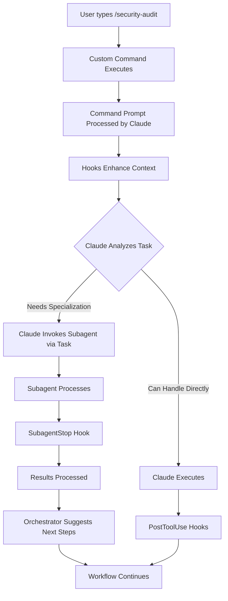

# Hooks, Commands, and Subagents: The Complete Integration Guide

## Understanding the Three Layers

### 1. Custom Slash Commands (`/command`)
- **What**: User-invoked task prompts defined as Markdown files
- **Location**: `.claude/commands/*.md`
- **Purpose**: Kickstart specific workflows with predefined prompts
- **Access**: Users type `/command` to execute
- **Example**: `/security-audit`, `/continue-work`, `/implement-feature`

### 2. Subagents
- **What**: Specialized AI assistants with custom system prompts
- **Location**: `.claude/agents/*.md`
- **Purpose**: Handle specific domains with focused expertise
- **Access**: Claude invokes via Task tool (not user-accessible directly)
- **Example**: `security-orchestrator`, `tdd-python-implementer`

### 3. Hooks
- **What**: Automated scripts triggered by Claude Code events
- **Location**: `.claude/hooks/*`
- **Purpose**: Enhance, validate, and orchestrate workflows
- **Access**: Automatic based on events
- **Example**: `subagent-router.py`, `prompt-enhancer.py`

## The Integration Flow



## Practical Example: Security Audit Workflow

### Step 1: User Invokes Command
```bash
> /security-audit
```

### Step 2: Command Definition Executes
File: `.claude/commands/security-audit.md`
```markdown
---
allowed-tools: Bash(git status:*), Read, Write, Task
description: Perform comprehensive security audit
---

Conduct a thorough security audit of the codebase:

1. Analyze authentication and authorization
2. Check for common vulnerabilities
3. Review dependencies for known issues
4. Create issues for critical findings
5. Update security documentation

Use specialized security analysis where appropriate.
```

### Step 3: Hooks Enhance Context
**UserPromptSubmit Hook** (`prompt-enhancer.py`):
- Adds recent security-related changes
- Includes dependency list
- Notes authentication files

**UserPromptSubmit Hook** (`subagent-router.py`):
- Detects security audit intent
- Suggests security-orchestrator subagent

### Step 4: Claude Processes Enhanced Prompt
Claude sees:
- Original command prompt
- Enhanced context from hooks
- Suggestion to use security-orchestrator

### Step 5: Claude Invokes Subagent
**PreToolUse Hook** (`subagent-context-preparer.py`):
- Prepares security-specific context
- Creates `.claude/context/security-context.json`

Claude executes:
```python
Task(
    subagent_type="security-orchestrator",
    prompt="Perform security analysis with prepared context"
)
```

### Step 6: Subagent Executes
Security-orchestrator subagent:
- Uses prepared context
- Performs deep analysis
- Identifies vulnerabilities
- Returns structured findings

### Step 7: Hooks Process Results
**SubagentStop Hook** (`subagent-result-processor.py`):
- Saves results to `.claude/agent-results/`
- Identifies critical issues
- Suggests bug-issue-creator for tracking

**SubagentStop Hook** (`subagent-orchestrator.py`):
- Detects security workflow pattern
- Suggests next subagents in chain
- Updates workflow state

### Step 8: Workflow Continues
Based on orchestrator suggestions:
1. bug-issue-creator subagent creates GitHub issues
2. tech-docs-maintainer updates security docs
3. Hooks validate and track progress

## Command → Subagent Patterns

### Pattern 1: Direct Delegation
```markdown
# Command explicitly mentions subagent
Use the security-orchestrator to analyze this codebase
```

### Pattern 2: Implicit Routing
```markdown
# Command describes task, hooks suggest subagent
Perform comprehensive security analysis following OWASP guidelines
```

### Pattern 3: Multi-Phase Workflow
```markdown
# Command triggers workflow chain
1. Analyze current implementation
2. Write tests using TDD
3. Refactor for clarity
4. Document changes
```

## Hook Integration Points

### For Custom Commands

#### Pre-Execution
- **SessionStart**: Load project context
- **UserPromptSubmit**: Enhance command prompt

#### During Execution
- **PreToolUse**: Validate tool usage
- **PostToolUse**: Process results

#### Post-Execution
- **Stop**: Validate completion
- **SessionEnd**: Cleanup

### For Subagents

#### Pre-Invocation
- **PreToolUse(Task)**: Prepare subagent context
- **Context Preparer**: Load domain-specific data

#### Post-Invocation
- **SubagentStop**: Process results
- **Orchestrator**: Chain to next subagent
- **Result Processor**: Save and analyze

## Creating Integrated Workflows

### Example: TDD Feature Implementation

#### 1. Create Command
`.claude/commands/implement-tdd.md`:
```markdown
---
description: Implement feature using TDD methodology
argument-hint: [feature description]
---

Implement the following feature using Test-Driven Development:
$ARGUMENTS

Follow the red-green-refactor cycle strictly.
Write tests first, make them pass, then refactor.
```

#### 2. Configure Hooks
`.claude/settings.local.json`:
```json
{
  "hooks": {
    "UserPromptSubmit": [{
      "command": ".claude/hooks/python/subagent-router.py"
    }],
    "PreToolUse": [{
      "matcher": "Task",
      "command": ".claude/hooks/python/subagent-context-preparer.py"
    }],
    "SubagentStop": [{
      "command": ".claude/hooks/python/subagent-orchestrator.py"
    }]
  }
}
```

#### 3. Subagent Available
`.claude/agents/tdd-python-implementer.md` exists and handles TDD tasks

#### 4. Workflow Executes
```
User: /implement-tdd User authentication system
  ↓
Command prompt enhanced by hooks
  ↓
Claude invokes tdd-python-implementer
  ↓
Subagent writes tests → code → refactors
  ↓
Orchestrator suggests code-clarity-refactorer
  ↓
Workflow continues...
```

## Best Practices

### Custom Commands Should:
1. Define clear, goal-oriented task prompts
2. Use `$ARGUMENTS` for dynamic input
3. Include context with `!bash` commands and `@file` references
4. Specify `allowed-tools` when appropriate
5. Be concise but comprehensive

### Subagents Should:
1. Have single, focused responsibilities
2. Include detailed system prompts
3. Specify restricted tool access when possible
4. Be reusable across different commands

### Hooks Should:
1. Enhance without blocking (unless critical)
2. Prepare context proactively
3. Process results for insights
4. Chain workflows intelligently

## Common Integration Scenarios

### Scenario 1: Bug Fix Workflow
```
/fix-bug 123
  → Hook: Loads issue context
  → Hook: Suggests bug-issue-creator
  → Claude: Analyzes bug
  → Subagent: code-synthesis-analyzer
  → Hook: Detects fix needed
  → Subagent: tdd-python-implementer
  → Hook: Validates fix
  → Subagent: git-diff-documenter
```

### Scenario 2: Code Review Workflow
```
/review
  → Hook: Loads recent changes
  → Claude: Reviews directly
  → Hook: Detects security concerns
  → Subagent: security-orchestrator
  → Hook: Creates issues for findings
  → Subagent: bug-issue-creator
```

### Scenario 3: Documentation Update
```
/update-docs
  → Hook: Identifies changed files
  → Subagent: git-diff-documenter
  → Hook: Detects API changes
  → Subagent: tech-docs-maintainer
  → Hook: Validates documentation
```

## Configuration Template

### Integrated Settings
```json
{
  "hooks": {
    "UserPromptSubmit": [
      {"command": ".claude/hooks/python/prompt-enhancer.py"},
      {"command": ".claude/hooks/python/subagent-router.py"}
    ],
    "PreToolUse": [{
      "matcher": "Task",
      "command": ".claude/hooks/python/subagent-context-preparer.py"
    }],
    "SubagentStop": [
      {"command": ".claude/hooks/python/subagent-result-processor.py"},
      {"command": ".claude/hooks/python/subagent-orchestrator.py"}
    ]
  }
}
```

## Debugging Integration

### Command Not Working
```bash
# Check command file exists
ls -la .claude/commands/

# Verify command syntax
cat .claude/commands/your-command.md

# Test manually
claude "/your-command test"
```

### Subagent Not Invoked
```bash
# Check subagent exists
ls -la .claude/agents/

# Verify router patterns
grep "your-subagent" .claude/hooks/python/subagent-router.py

# Check context preparation
ls -la .claude/context/
```

### Hooks Not Triggering
```bash
# Verify hook configuration
cat .claude/settings.local.json

# Check hook permissions
ls -la .claude/hooks/

# Monitor hook execution
tail -f .claude/logs/hook-execution.log
```

## Summary

The integration of hooks, commands, and subagents creates a powerful development ecosystem:

- **Commands** provide user-friendly workflow entry points
- **Subagents** deliver specialized expertise when needed
- **Hooks** orchestrate and enhance the entire system

Together, they transform Claude Code into an intelligent development platform that:
- Understands user intent
- Routes to appropriate specialists
- Maintains context across operations
- Learns from patterns
- Improves over time