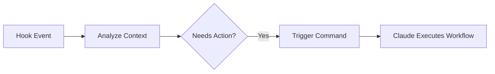
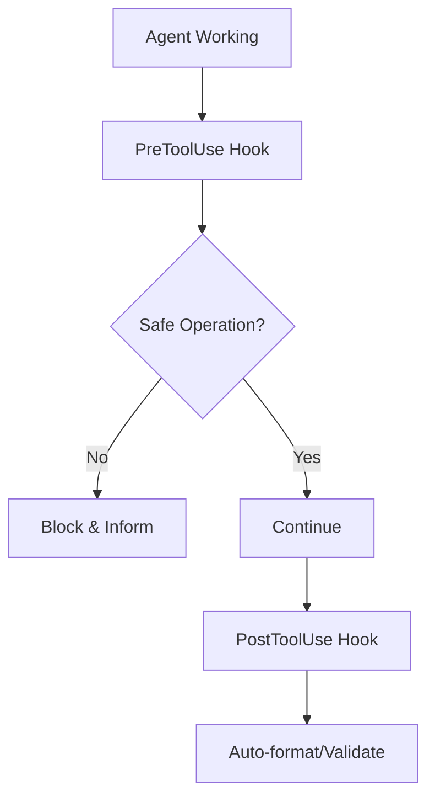

# Hooks, Commands, and Agents: Complete Integration Guide

This guide consolidates all integration patterns for hooks, commands, and agents in Claude Code.

## 📚 Table of Contents

1. [Understanding the Three Layers](#understanding-the-three-layers)
2. [Integration Patterns](#integration-patterns)
3. [Workflow Orchestration](#workflow-orchestration)
4. [Practical Examples](#practical-examples)
5. [Best Practices](#best-practices)

## Understanding the Three Layers

### Layer 1: Hooks (Automation & Context)
- **Purpose**: Deterministic automation at specific events
- **Trigger**: Automatic based on Claude's actions
- **Control**: Can block operations, inject context, enforce rules
- **Examples**: Pre-commit checks, auto-formatting, security validation

### Layer 2: Commands (Workflow Initiators)
- **Purpose**: User-triggered complex workflows
- **Trigger**: User types `/command`
- **Control**: Defines task prompts for Claude
- **Examples**: `/quality-pipeline`, `/security-audit`, `/tdd-implement`

### Layer 3: Agents (Specialized Executors)
- **Purpose**: Domain-specific expertise
- **Trigger**: Claude invokes via Task tool
- **Control**: Focused system prompts for specific tasks
- **Examples**: memory-profiler, security-analyzer, test-generator

## Integration Patterns

### Pattern 1: Hook → Command Chain


**Example**: PostToolUse hook detects performance regression → triggers `/performance-optimize` command

### Pattern 2: Command → Agent Pipeline
```mermaid
graph LR
    A[/command] --> B[Claude Receives Task]
    B --> C[Agent 1: Analyze]
    C --> D[Agent 2: Implement]
    D --> E[Agent 3: Verify]
```

**Example**: `/feature-full-cycle` → tech detection → appropriate TDD agent → test generator → docs maintainer

### Pattern 3: Hook-Enhanced Agent Execution


**Example**: Security analyzer agent + hooks that enforce security policies

## Workflow Orchestration

### Security-First Development
```yaml
Workflow:
  SessionStart:
    - Load security policies
    - Check dependencies for vulnerabilities
  
  PreToolUse:
    - Validate file access permissions
    - Check for secrets in code
  
  Command: /security-audit
    - Invokes: security-analyzer agent
    - Then: bug-issue-creator agent
  
  PostToolUse:
    - Run security linters
    - Update security log
```

### Quality-Driven Pipeline
```yaml
Workflow:
  UserPromptSubmit:
    - Inject code quality context
    - Load recent issues
  
  Command: /quality-pipeline
    - Chain: memory-profiler → performance-optimizer → test-generator
  
  PostToolUse:
    - Format code
    - Run incremental tests
    - Update documentation
```

### Test-Driven Development
```yaml
Workflow:
  PreToolUse[Edit]:
    - Ensure tests exist before implementation
  
  Command: /tdd-implement
    - Detect language
    - Invoke: tdd-python or tdd-typescript
  
  PostToolUse[Write]:
    - Run affected tests
    - Check coverage
```

## Practical Examples

### Example 1: Automated Code Review on Git Push

**Hook Configuration**:
```json
{
  "hooks": {
    "PostToolUse": [
      {
        "matcher": "Bash",
        "hooks": [{
          "type": "command",
          "command": "bash -c 'if [[ \"$1\" =~ \"git push\" ]]; then echo \"/code-review\"; fi'"
        }]
      }
    ]
  }
}
```

**Flow**:
1. Developer pushes code
2. PostToolUse hook detects git push
3. Triggers `/code-review` command
4. Command chains: code-quality-analyzer → security-analyzer → test-generator
5. Results posted as PR comment

### Example 2: Context-Aware Development

**Setup**:
```json
{
  "hooks": {
    "SessionStart": [
      {
        "hooks": [{
          "type": "command",
          "command": ".claude/hooks/python/smart-context-injector.py"
        }]
      }
    ],
    "UserPromptSubmit": [
      {
        "hooks": [{
          "type": "command",
          "command": ".claude/hooks/bash/branch-context-loader.sh"
        }]
      }
    ]
  }
}
```

**Behavior**:
- On session start: Loads project context, recent issues, dependencies
- On prompt submit: Injects branch-specific context
- Commands have full context for better execution

### Example 3: Performance Monitoring Pipeline

**Integration**:
```markdown
# .claude/commands/performance-monitor.md
---
allowed-tools: Task, Bash
description: Continuous performance monitoring
---

Monitor performance with chained agents:

1. Use memory-profiler agent to baseline
2. Use performance-optimizer for hotspots
3. PostToolUse hooks track metrics
4. Alert if regression detected
```

**Hook Support**:
```python
# PostToolUse hook
if metrics['response_time'] > baseline * 1.2:
    return {
        "decision": "warn",
        "message": "Performance regression detected. Run /performance-optimize"
    }
```

## Best Practices

### 1. Layer Separation
- **Hooks**: Automation and enforcement
- **Commands**: User-facing workflows
- **Agents**: Specialized execution
- Don't mix responsibilities

### 2. Context Flow
```
Hooks (gather) → Commands (orchestrate) → Agents (execute) → Hooks (validate)
```

### 3. Error Handling
- Hooks can block dangerous operations
- Commands should handle agent failures
- Agents should return clear status

### 4. Performance
- Hooks must be fast (<500ms)
- Commands can chain multiple agents
- Agents can take time for complex tasks

### 5. Documentation
- Document hook side effects
- Describe command workflows
- Specify agent capabilities

## Configuration Templates

### Minimal Integration
```json
{
  "hooks": {
    "PostToolUse": [{
      "matcher": "Edit|Write",
      "hooks": [{
        "type": "command",
        "command": "echo 'File modified, consider running tests'"
      }]
    }]
  }
}
```

### Full Integration
```json
{
  "hooks": {
    "SessionStart": ["context-loader", "dependency-checker"],
    "PreToolUse": ["security-validator", "permission-checker"],
    "PostToolUse": ["formatter", "test-runner"],
    "UserPromptSubmit": ["context-injector", "history-loader"]
  }
}
```

## Troubleshooting

| Issue | Solution |
|-------|----------|
| Hook blocks agent execution | Check hook exit codes, ensure non-blocking for agent operations |
| Command doesn't trigger agents | Verify Task tool is in allowed-tools |
| Context not passing between agents | Check agent output format, ensure proper JSON |
| Workflow too slow | Profile hooks, consider parallel agent execution |

## Summary

The integration of hooks, commands, and agents creates a powerful development environment:
- **Hooks** provide the nervous system (automatic responses)
- **Commands** provide the interface (user intentions)
- **Agents** provide the expertise (specialized execution)

Together, they enable sophisticated workflows that adapt to your development needs while maintaining quality and security standards.