# Practical Examples: Hooks and Agents Working Together

## Real-World Scenarios

### Scenario 1: Security-First Development Workflow

**User Request**: "I need to add a new authentication endpoint to our API"

**What Happens Behind the Scenes**:

1. **UserPromptSubmit Hook** (`agent-router.py`)
   - Detects "authentication" keyword
   - Suggests `/security-orchestrator` agent
   - Enhances prompt with security context

2. **User Accepts**: "Yes, use the security orchestrator"

3. **PreToolUse Hook** (`agent-context-preparer.py`)
   - Scans for existing auth files
   - Identifies authentication patterns in codebase
   - Loads security configuration
   - Creates context file at `.claude/context/security-context.json`

4. **Security Orchestrator Agent Executes**
   - Uses prepared context to understand auth architecture
   - Performs security analysis
   - Identifies potential vulnerabilities
   - Suggests secure implementation

5. **SubagentStop Hook** (`agent-result-processor.py`)
   - Captures security findings
   - Identifies 2 high-priority issues
   - Saves results to `.claude/agent-results/`
   - Outputs summary with follow-up suggestions

6. **SubagentStop Hook** (`agent-orchestrator.py`)
   - Detects security workflow pattern
   - Automatically suggests `/bug-issue-creator` for high-priority issues
   - Queues `/tech-docs-maintainer` for documentation

7. **Workflow Continues** automatically or with user approval

### Scenario 2: TDD Feature Implementation

**User Request**: "Implement a data validation module using TDD"

**Workflow Execution**:

```mermaid
graph TD
    A[User: Implement validation with TDD] --> B[agent-router suggests /tdd-python]
    B --> C[agent-context-preparer loads test framework]
    C --> D[TDD Agent writes first test]
    D --> E[test-runner hook runs test - FAILS ✓]
    E --> F[TDD Agent implements minimal code]
    F --> G[test-runner hook runs test - PASSES ✓]
    G --> H[TDD Agent refactors]
    H --> I[agent-result-processor saves metrics]
    I --> J[agent-orchestrator suggests /code-clarity-refactorer]
    J --> K[Refactoring improves code quality]
    K --> L[git-diff-documenter documents changes]
```



**Hook-Agent Interactions**:
- Hooks provide continuous validation (test-runner)
- Agents focus on implementation (tdd-python-implementer)
- Results flow between agents via hooks (orchestrator)

### Scenario 3: Bug Discovery to Resolution

**User Request**: "The API is returning 500 errors on user updates"

**Integrated Response**:

1. **Initial Analysis**
   ```python
   # prompt-enhancer.py adds context:
   - Recent error logs
   - API endpoint structure
   - Recent changes to user module
   ```

2. **Agent Router Activation**
   ```python
   # agent-router.py suggests:
   🎯 /code-synthesis-analyzer (high confidence: 85%)
   💡 /bug-issue-creator (medium confidence: 60%)
   ```

3. **Code Synthesis Analyzer Runs**
   - Hook prepares: file changes, test results, dependencies
   - Agent analyzes: finds race condition in user update
   - Hook processes: categorizes as "critical bug"

4. **Automatic Workflow Trigger**
   ```python
   # agent-orchestrator.py triggers chain:
   1. bug-issue-creator (create GitHub issue)
   2. tdd-python-implementer (write failing test)
   3. code-clarity-refactorer (fix implementation)
   4. git-diff-documentation-agent (document fix)
   ```

5. **Quality Gates**
   ```python
   # work-completion-assistant.py validates:
   ✅ Bug reproduced in test
   ✅ Fix implemented
   ✅ Tests passing
   ✅ Issue documented
   ```

### Scenario 4: Documentation Update Cascade

**User Request**: "Update our API documentation"

**Smart Integration Flow**:

```yaml
Step 1: Context Loading (Hooks)
  - branch-context-loader: Identifies documentation branch
  - dependency-scanner: Lists API dependencies
  - prompt-enhancer: Adds API endpoint inventory

Step 2: Agent Execution (Agents)
  - web-docs-researcher: Fetches latest framework docs
  - tech-docs-maintainer: Updates technical docs
  - git-diff-documentation-agent: Documents changes

Step 3: Validation (Hooks)
  - doc-validator: Checks documentation format
  - test-runner: Validates code examples
  - error-catcher: Ensures no broken links

Step 4: Orchestration (Integration)
  - agent-orchestrator: Links documentation tasks
  - agent-result-processor: Aggregates updates
  - notification-handler: Alerts team of changes
```

### Scenario 5: Complex Multi-Agent Investigation

**User Request**: "Why is our application slow after the last deployment?"

**Orchestrated Investigation**:

1. **Phase 1: Analysis** (Hooks prepare, agents investigate)
   ```
   Hooks: Load performance baselines, recent changes
   Agent: code-synthesis-analyzer
   Result: Identifies new database queries
   ```

2. **Phase 2: Deep Dive** (Conditional routing)
   ```
   Hook: Detects database performance issue
   Agent: multi-agent-synthesis-orchestrator
   Sub-agents: Query analyzer, index optimizer
   Result: Missing database index identified
   ```

3. **Phase 3: Resolution** (Automated fix workflow)
   ```
   Hook: Prepares database schema context
   Agent: code-clarity-refactorer
   Action: Adds index migration
   Hook: test-runner validates performance
   ```

4. **Phase 4: Documentation** (Completion workflow)
   ```
   Agent: git-diff-documentation-agent
   Action: Documents performance fix
   Agent: bug-issue-creator
   Action: Creates tracking issue
   Hook: notification-handler alerts team
   ```

## Integration Patterns in Action

### Pattern 1: Fail-Fast with Recovery
```python
# Hook blocks dangerous operation
PreToolUse(security-validator) → Block: "Credential detected"
  ↓
# Agent provides secure alternative  
Agent(security-orchestrator) → "Use environment variable"
  ↓
# Hook validates fix
PostToolUse(security-validator) → Pass: "Secure implementation"
```

### Pattern 2: Progressive Enhancement
```python
# Basic prompt
User: "Fix the bug"
  ↓
# Hook enhances with context
UserPromptSubmit(prompt-enhancer) → Add: error logs, stack trace
  ↓
# Hook suggests specialist
UserPromptSubmit(agent-router) → Suggest: /bug-issue-creator
  ↓
# Agent executes with full context
Agent(bug-issue-creator) → Creates detailed issue with reproduction
```

### Pattern 3: Automated Quality Pipeline
```python
# Code modification triggers cascade
Edit(file.py) →
  PostToolUse(test-runner) →
    PostToolUse(linter) →
      PostToolUse(type-checker) →
        SubagentStop(quality-reporter)
```

## Configuration Examples

### Minimal Integration (Quick Start)
```json
{
  "hooks": {
    "UserPromptSubmit": [{
      "command": ".claude/hooks/python/agent-router.py"
    }],
    "SubagentStop": [{
      "command": ".claude/hooks/python/agent-result-processor.py"
    }]
  }
}
```

### Advanced Integration (Full Orchestration)
```json
{
  "hooks": {
    "SessionStart": [
      {"command": ".claude/hooks/bash/branch-context-loader.sh"},
      {"command": ".claude/hooks/python/agent-availability-checker.py"}
    ],
    "UserPromptSubmit": [
      {"command": ".claude/hooks/python/prompt-enhancer.py"},
      {"command": ".claude/hooks/python/agent-router.py"}
    ],
    "PreToolUse": [
      {
        "matcher": "Task",
        "command": ".claude/hooks/python/agent-context-preparer.py"
      }
    ],
    "SubagentStop": [
      {"command": ".claude/hooks/python/agent-result-processor.py"},
      {"command": ".claude/hooks/python/agent-orchestrator.py"}
    ]
  }
}
```

## Benefits of Integration

### For Users
- **Less Manual Work**: Workflows continue automatically
- **Better Results**: Agents have rich context from hooks
- **Fewer Errors**: Hooks validate before problems occur
- **Clear Progress**: Hooks report what agents are doing

### For Teams
- **Consistent Workflows**: Same patterns for everyone
- **Knowledge Sharing**: Hooks capture team practices
- **Quality Assurance**: Automated checks at every step
- **Audit Trail**: Complete record of all operations

### For Code Quality
- **Proactive Prevention**: Issues caught before commit
- **Comprehensive Coverage**: Multiple validation layers
- **Continuous Improvement**: Metrics drive optimization
- **Documentation**: Automatic tracking of all changes

## Debugging Integration Issues

### Common Problems and Solutions

**Problem**: Agent not getting suggested
```bash
# Check agent-router patterns
cat .claude/hooks/python/agent-router.py | grep -A5 "agent_patterns"

# Test router with sample prompt
echo '{"prompt":"implement security feature"}' | python .claude/hooks/python/agent-router.py
```

**Problem**: Workflow not continuing
```bash
# Check workflow state
cat .claude/workflow-state.json

# Reset if needed
rm .claude/workflow-state.json
```

**Problem**: Context not available to agent
```bash
# Verify context files created
ls -la .claude/context/

# Check preparer execution
tail -f .claude/logs/hook-execution.log
```

## Best Practices

1. **Start Simple**: Begin with agent-router and result-processor
2. **Add Gradually**: Introduce orchestration after basic integration works
3. **Monitor Performance**: Use metrics to identify bottlenecks
4. **Document Workflows**: Keep README updated with active workflows
5. **Test Integration**: Verify hooks and agents work together
6. **Iterate Based on Usage**: Refine patterns based on team needs

## Conclusion

The integration of hooks and agents transforms Claude Code from a reactive assistant to a proactive development partner that:
- Anticipates your needs
- Automates routine workflows
- Maintains quality standards
- Learns from patterns
- Improves over time

This synergy creates a development environment where the mundane is automated, quality is assured, and developers can focus on creative problem-solving.