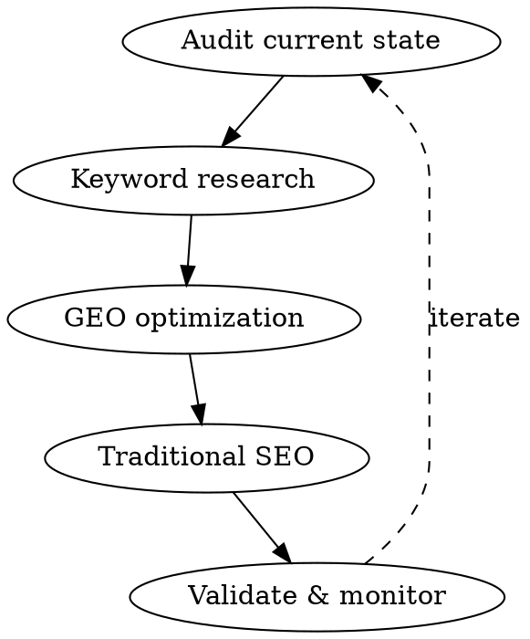

# SEO/GEO Optimization

Optimize web content for both traditional search engines (Google, Bing) and AI search engines (ChatGPT, Perplexity, Gemini, Copilot, Claude).

**GEO = Generative Engine Optimization** - Optimizing content to be cited by AI search engines.

**Key Insight:** AI search engines don't rank pages - they cite sources. Being cited is the new ranking #1.

## When to Use

- Auditing a website's SEO/GEO status
- Optimizing content for AI search engine citations
- Implementing or fixing structured data (JSON-LD, Schema.org)
- Researching keywords and competitor strategies
- Ensuring AI bots can crawl your site
- Adding meta tags, Open Graph, Twitter Cards
- Improving content structure for both humans and AI

**Don't use for:**
- General content writing without SEO focus (use creative-writing skill)
- Backend API performance (use performance-optimizer)

## Workflow



### Step 1: Website Audit

Get the target URL and analyze current SEO/GEO status.

**Quick technical check:**
```bash
# Check meta tags and schema markup
curl -sL "https://example.com" | grep -E "<title>|<meta name=\"description\"|<meta property=\"og:|application/ld\+json" | head -20

# Check robots.txt - verify AI bots are allowed
curl -s "https://example.com/robots.txt"

# Check sitemap structure
curl -s "https://example.com/sitemap.xml" | head -50
```

**AI bots to verify access for:**

| Bot | Service |
|-----|---------|
| Googlebot | Google |
| Bingbot | Bing / Copilot |
| PerplexityBot | Perplexity |
| ChatGPT-User | ChatGPT with browsing |
| ClaudeBot / anthropic-ai | Claude |
| GPTBot | OpenAI |

### Step 2: Keyword Research

Use **WebSearch** to research target keywords:
- `{keyword} keyword difficulty site:ahrefs.com OR site:semrush.com`
- `{keyword} search volume {current_year}`
- `site:{competitor.com} {keyword}`

Analyze search volume, difficulty, competitor strategies, long-tail opportunities, and international keyword conflicts.

### Step 3: GEO Optimization (AI Search Engines)

Apply the **9 Princeton GEO Methods** (see [reference/geo-methods.md](reference/geo-methods.md)):

| Method | Boost | Priority |
|--------|-------|----------|
| Cite Sources | +40% | Must-have |
| Statistics Addition | +37% | Must-have |
| Quotation Addition | +30% | Should-have |
| Authoritative Tone | +25% | Should-have |
| Fluency Optimization | +15-30% | Must-have |
| Easy-to-understand | +20% | Should-have |
| Technical Terms | +18% | Context-dependent |
| Unique Words | +15% | Nice-to-have |
| ~~Keyword Stuffing~~ | **-10%** | **AVOID** |

**Best combination:** Fluency + Statistics = Maximum boost

**Content structure for AI citation:**
- "Answer-first" format (direct answer at top)
- Clear H1 > H2 > H3 hierarchy
- Bullet points and numbered lists
- Tables for comparison data
- Short paragraphs (2-3 sentences max)

**FAQPage schema** adds +40% AI visibility. See [templates/schema-faqpage.json](templates/schema-faqpage.json).

### Step 4: Traditional SEO

Apply meta tags, Open Graph, Twitter Cards, and JSON-LD schema markup. See [templates/meta-tags.md](templates/meta-tags.md) for copy-paste templates.

**Quick checks:**
- H1 contains primary keyword
- Images have descriptive alt text
- Internal links to related content
- External links have `rel="noopener noreferrer"`
- Mobile-friendly layout
- Page loads in < 3 seconds

### Step 5: Validate & Monitor

```bash
# Schema validation
open "https://search.google.com/test/rich-results?url={encoded_url}"
open "https://validator.schema.org/?url={encoded_url}"

# Check indexing
open "https://www.google.com/search?q=site:{domain}"
open "https://www.bing.com/search?q=site:{domain}"
```

Generate report using [checklists/seo-geo-audit.md](checklists/seo-geo-audit.md).

## Platform-Specific Quick Reference

Each AI search engine has different citation criteria. See [reference/platform-optimization.md](reference/platform-optimization.md) for full details.

| Platform | Key Factor | Critical Action |
|----------|-----------|-----------------|
| ChatGPT | Domain authority | Update content within 30 days |
| Perplexity | Semantic relevance | FAQPage schema + PDF hosting |
| Google AI Overview | E-E-A-T | Authoritative citations (+132%) |
| Copilot / Bing | Bing indexing | Page speed < 2s |
| Claude | Brave Search | High factual density |

## Common Mistakes

| Mistake | Fix |
|---------|-----|
| Blocking AI bots in robots.txt | Allow PerplexityBot, GPTBot, ClaudeBot explicitly |
| Keyword stuffing | Reduces visibility by 10%. Use natural language. |
| Missing FAQPage schema | Adds +40% AI visibility. Always include for FAQ content. |
| No statistics or citations | GEO research shows +37-40% boost from data and sources |
| Ignoring Brave Search | Claude uses Brave, not Google. Ensure Brave indexing. |
| Stale content | ChatGPT cites 3.2x more from content updated within 30 days |

## Collaboration

- **Works with**: `content-strategist` agent (strategy + keyword planning), `creative-writing` skill (content quality)
- **Complements**: Content strategy with technical SEO implementation and GEO methodology
- **Outputs**: Optimized markup, schema, audit reports, GEO-enhanced content

## Supporting Documentation

- **[reference/](reference/)** - Detailed optimization guides
  - [geo-methods.md](reference/geo-methods.md) - Princeton GEO research (9 methods in depth)
  - [platform-optimization.md](reference/platform-optimization.md) - Per-platform citation criteria

- **[checklists/](checklists/)** - Audit and validation
  - [seo-geo-audit.md](checklists/seo-geo-audit.md) - Complete SEO/GEO audit checklist with report template

- **[templates/](templates/)** - Copy-paste ready markup
  - [meta-tags.md](templates/meta-tags.md) - Meta tags, Open Graph, Twitter Cards
  - [schema-faqpage.json](templates/schema-faqpage.json) - FAQPage JSON-LD template
  - [schema-templates.md](templates/schema-templates.md) - All JSON-LD schema types
