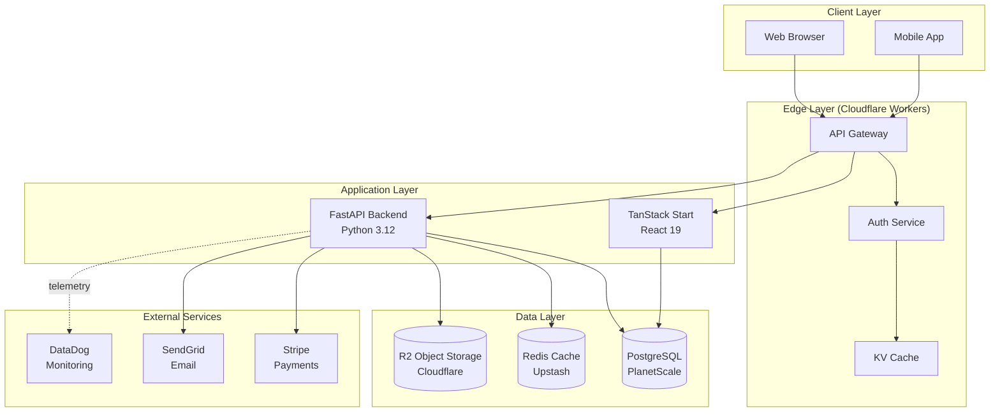
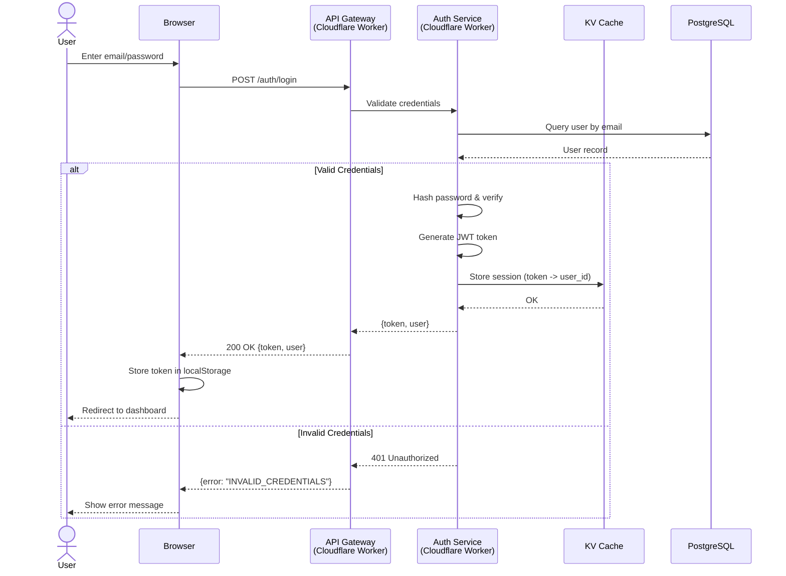
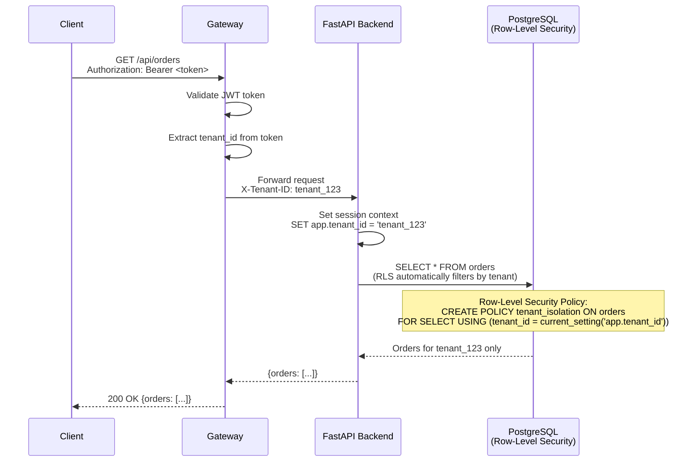
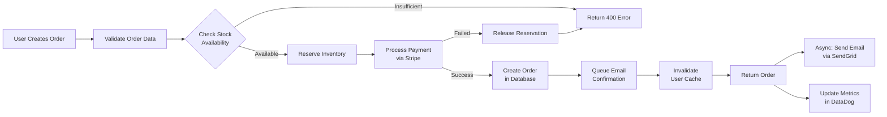
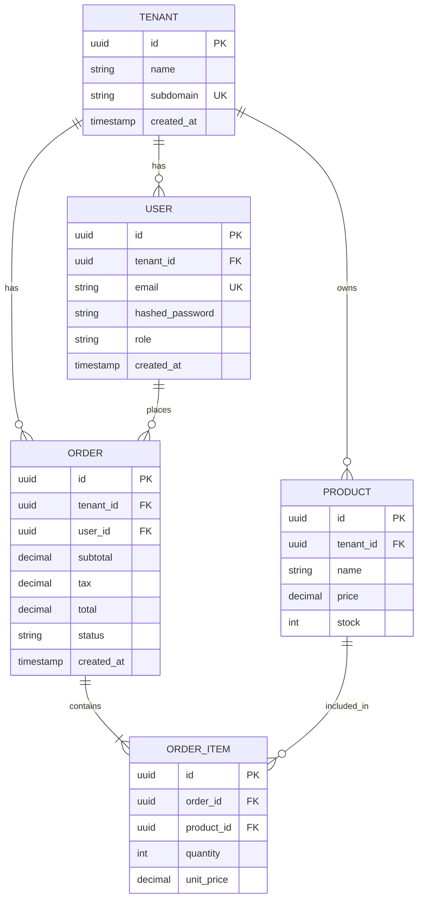
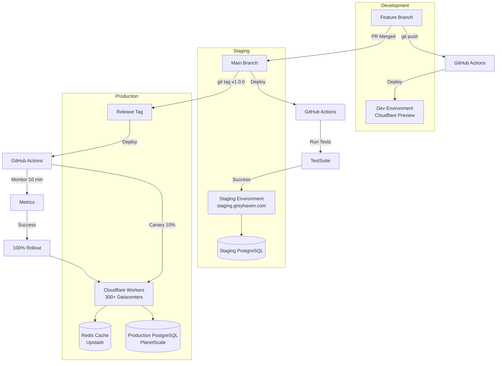
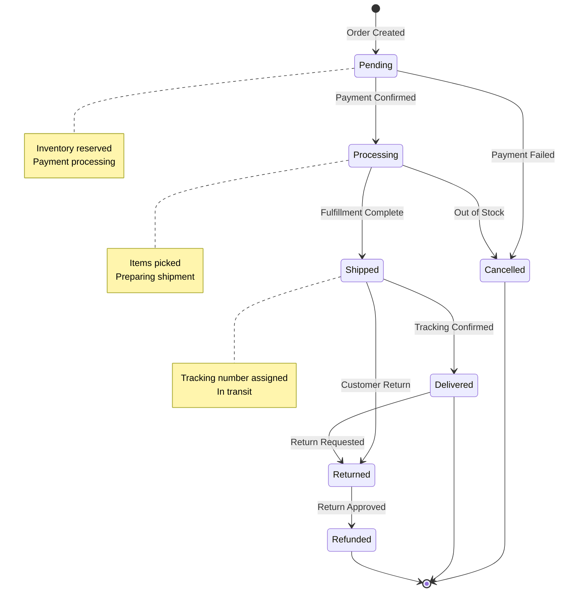

# Example: System Architecture Documentation with Mermaid Diagrams

Complete workflow for creating comprehensive system architecture documentation for a distributed Grey Haven application.

## Context

**Project**: Multi-Tenant SaaS Platform (TanStack Start + Cloudflare Workers + FastAPI + PostgreSQL)
**Problem**: New developers taking 3-4 weeks to understand system architecture, high onboarding cost
**Goal**: Create comprehensive architecture documentation that reduces onboarding time to <1 week

**Initial State**:
- No architecture documentation
- Tribal knowledge spread across 8 senior developers
- New hires asking same questions repeatedly
- 3-4 weeks until new developer productive
- Architecture decisions not documented (ADRs missing)

## Step 1: System Overview with Mermaid

### High-Level Architecture Diagram



## Step 2: Request Flow Sequence Diagrams

### User Authentication Flow



### Multi-Tenant Data Access Flow



## Step 3: Data Flow Diagram

### Order Processing Data Flow



## Step 4: Database Schema ER Diagram



## Step 5: Deployment Architecture



## Step 6: State Machine Diagram for Order Status



## Step 7: Architecture Decision Records (ADRs)

### ADR-001: Choose Cloudflare Workers for Edge Computing

```markdown
# ADR-001: Use Cloudflare Workers for API Gateway and Auth

**Date**: 2024-01-15
**Status**: Accepted
**Decision Makers**: Engineering Team

## Context

We need an edge computing platform for API gateway, authentication, and caching that:
- Provides global low latency (<50ms p95)
- Scales automatically without management
- Integrates with our CDN infrastructure
- Supports multi-tenant architecture

## Decision

We will use Cloudflare Workers for edge computing with KV for session storage.

## Alternatives Considered

1. **AWS Lambda@Edge**: Good performance but vendor lock-in, higher cost
2. **Traditional Load Balancer**: Single region, no edge caching
3. **Self-hosted Edge Nodes**: Complex deployment, maintenance overhead

## Consequences

**Positive**:
- Global deployment (300+ datacenters) with <50ms latency worldwide
- Auto-scaling to zero cost when idle
- Built-in DDoS protection and WAF
- KV storage for session caching (sub-millisecond reads)
- 1ms CPU time limit forces efficient code

**Negative**:
- 1ms CPU time limit requires careful optimization
- Cold starts (though <10ms typically)
- Limited to JavaScript/TypeScript/Rust/Python (via Pyodide)
- No native PostgreSQL driver (must use HTTP-based client)

## Implementation

- API Gateway: Handles routing, CORS, rate limiting
- Auth Service: JWT validation, session management (KV)
- Cache Layer: API response caching (KV + Cache API)

## Monitoring

- Worker CPU time (aim for <500μs p95)
- KV cache hit rate (aim for >95%)
- Edge response time (aim for <50ms p95)
```

### ADR-002: PostgreSQL with Row-Level Security for Multi-Tenancy

```markdown
# ADR-002: PostgreSQL Row-Level Security (RLS) for Multi-Tenant Isolation

**Date**: 2024-01-20
**Status**: Accepted

## Context

Multi-tenant SaaS requires strict data isolation. Accidental cross-tenant data access would be a critical security breach.

## Decision

Use PostgreSQL Row-Level Security (RLS) policies to enforce tenant isolation at the database level.

## Implementation

```sql
-- Enable RLS on all tables
ALTER TABLE orders ENABLE ROW LEVEL SECURITY;

-- Create policy that filters by session tenant_id
CREATE POLICY tenant_isolation ON orders
    FOR ALL
    USING (tenant_id = current_setting('app.tenant_id', true)::uuid);

-- Application sets tenant context per request
SET app.tenant_id = '<tenant_id_from_jwt>';
```

## Consequences

**Positive**:
- Database-level enforcement (cannot be bypassed by application bugs)
- Automatic filtering on all queries (including ORMs)
- Performance: RLS uses indexes efficiently

**Negative**:
- Requires setting session context per connection
- Slightly more complex query plans

## Monitoring

- Weekly audit: Check for tables missing RLS
- Quarterly penetration test: Attempt cross-tenant access
```

## Results

### Before

- No architecture documentation
- 3-4 weeks until new developer productive
- 15+ hours/week answering architecture questions
- Architecture decisions lost to time
- Difficult to identify bottlenecks

### After

- Comprehensive architecture docs with 8 Mermaid diagrams
- 5 Architecture Decision Records documenting key choices
- Documentation in Git (versioned, reviewed)
- Interactive diagrams (clickable, navigable)

### Improvements

- Onboarding time: 3-4 weeks → 4-5 days (75% reduction)
- Architecture questions: 15 hrs/week → 2 hrs/week (87% reduction)
- New developer productivity: Week 4 → Week 1
- Time to understand data flow: 2 weeks → 1 day

### Developer Feedback

- "The sequence diagrams made auth flow crystal clear"
- "ERD diagram helped me understand relationships immediately"
- "ADRs answered 'why did we choose X?' questions"

## Key Lessons

1. **Mermaid Diagrams**: Version-controlled, reviewable, always up-to-date
2. **Multiple Perspectives**: System, sequence, data flow, deployment diagrams all needed
3. **ADRs are Critical**: "Why" is as important as "what"
4. **Progressive Disclosure**: Overview first, then drill into details
5. **Keep Diagrams Simple**: One concept per diagram, not everything at once

## Prevention Measures

**Implemented**:
- [x] All architecture docs in Git (versioned)
- [x] Mermaid diagrams (not static images)
- [x] ADR template for all major decisions
- [x] Onboarding checklist includes reading architecture docs

**Ongoing**:
- [ ] Auto-generate diagrams from code (infrastructure as code)
- [ ] Quarterly architecture review (docs up-to-date?)
- [ ] New ADR for every major technical decision

---

Related: [openapi-generation.md](openapi-generation.md) | [coverage-validation.md](coverage-validation.md) | [Return to INDEX](INDEX.md)
