# Mermaid Diagram Templates for Architecture Documentation

Comprehensive guide to Mermaid diagram types for visualizing system architecture, data flows, and interactions.

## Why Mermaid?

- **Version Controlled**: Diagrams in code, reviewable in PRs
- **Always Up-to-Date**: Easy to update alongside code changes
- **No Image Files**: Rendered dynamically in documentation
- **GitHub Native**: Renders in README.md and issues
- **Interactive**: Clickable links, zooming

## System Architecture Diagrams

### Basic Architecture

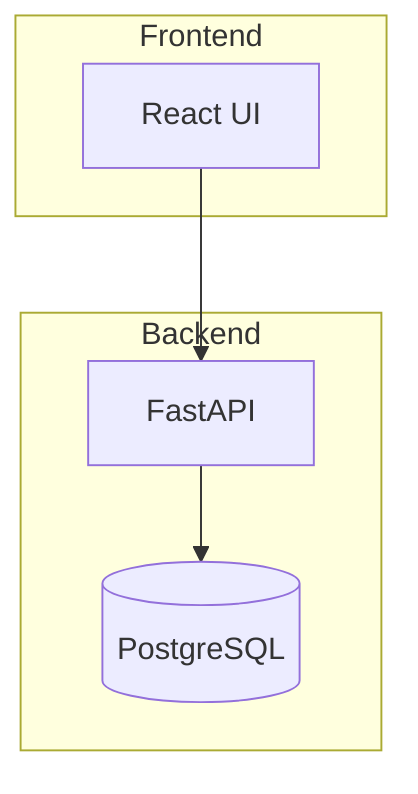

### Multi-Tier Architecture

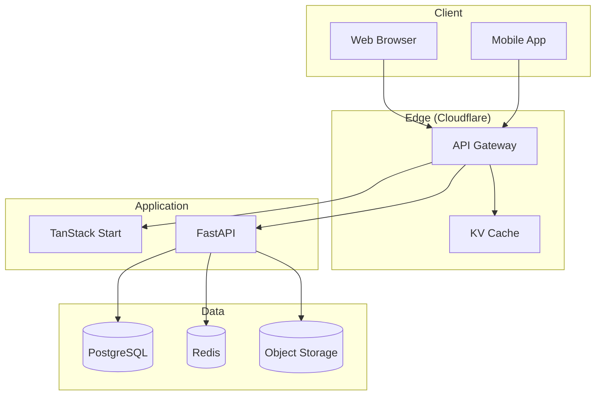

### Microservices Architecture

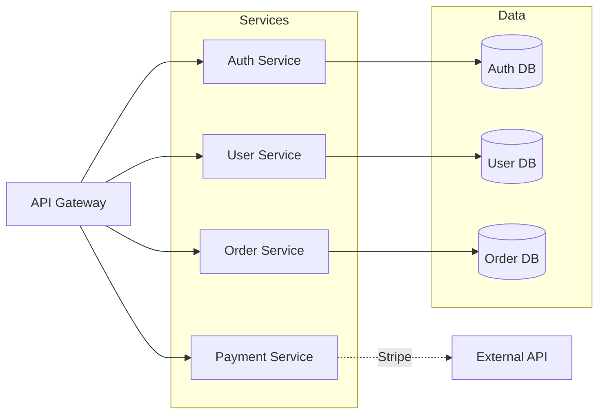

## Sequence Diagrams

### Authentication Flow

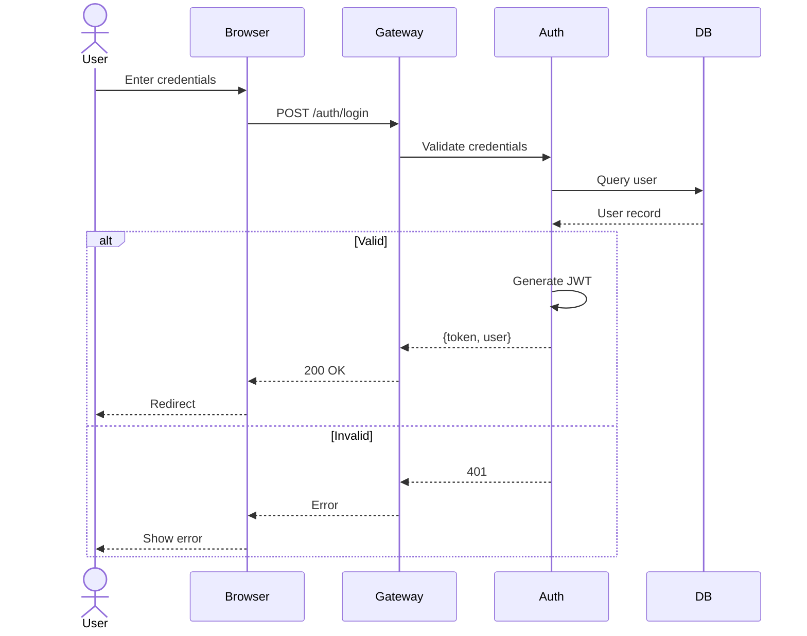

### API Request Flow

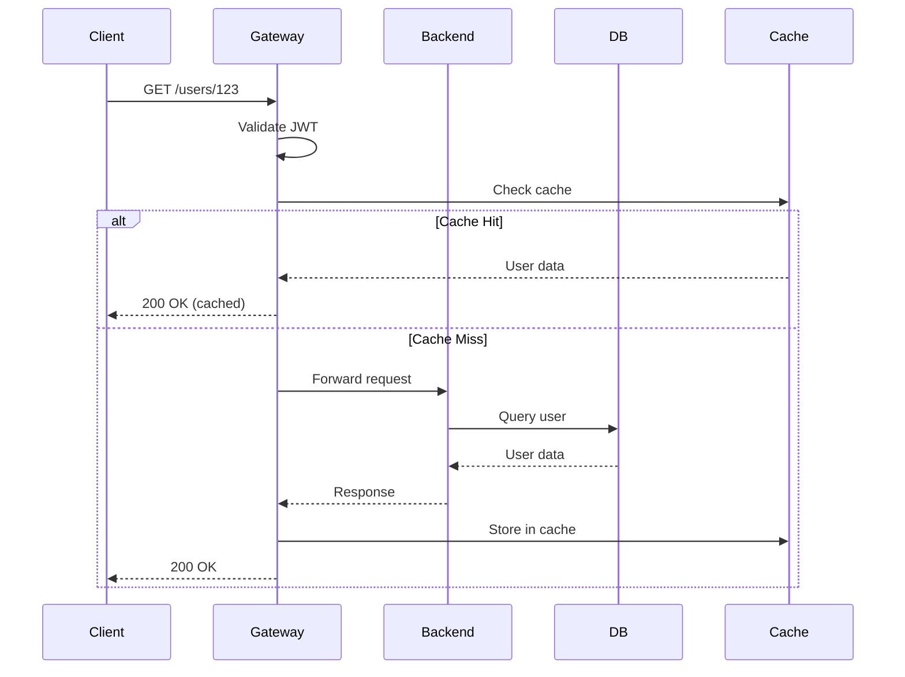

### Payment Processing

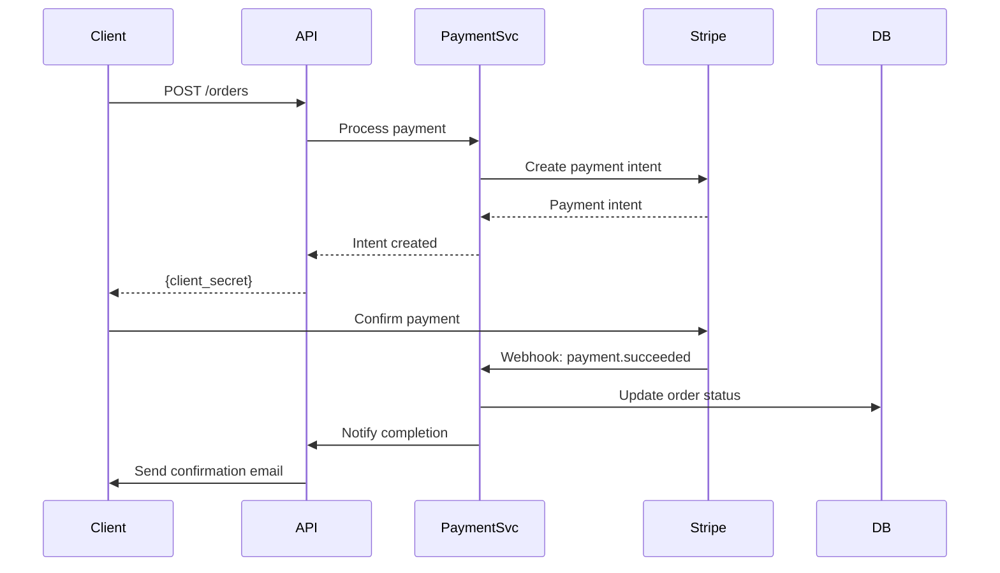

## Data Flow Diagrams

### Order Processing Flow

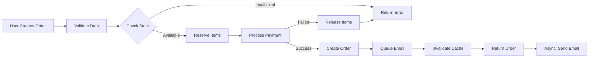

### Data Transformation Pipeline

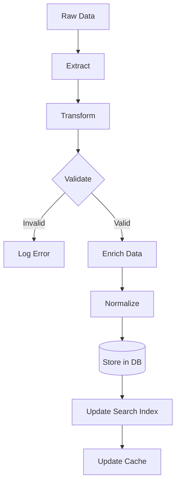

## Entity Relationship Diagrams

### Multi-Tenant E-Commerce

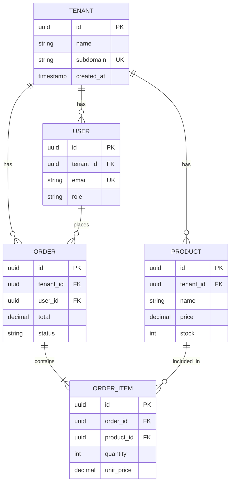

### User Authentication Schema

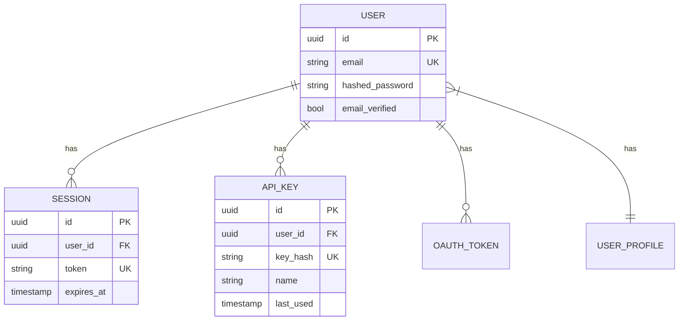

## State Diagrams

### Order State Machine

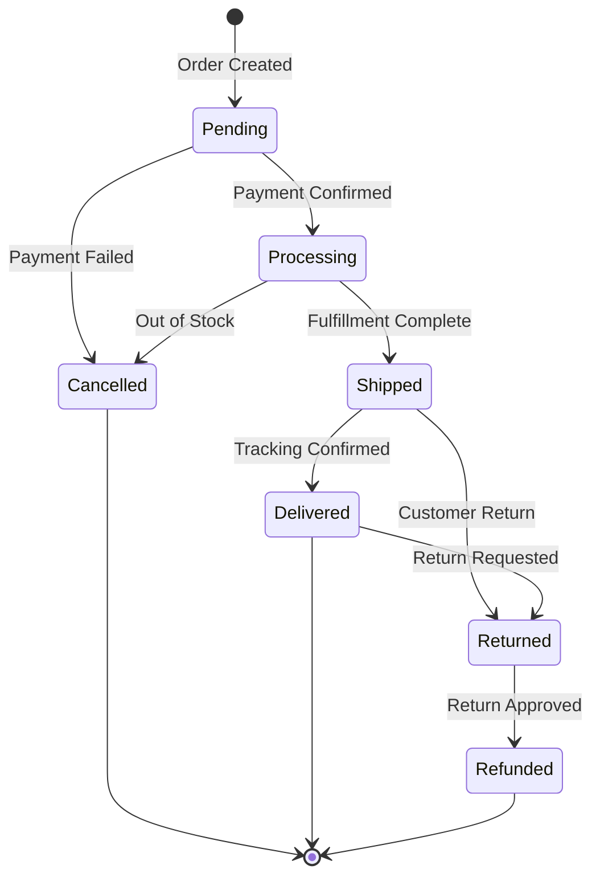

### User Lifecycle

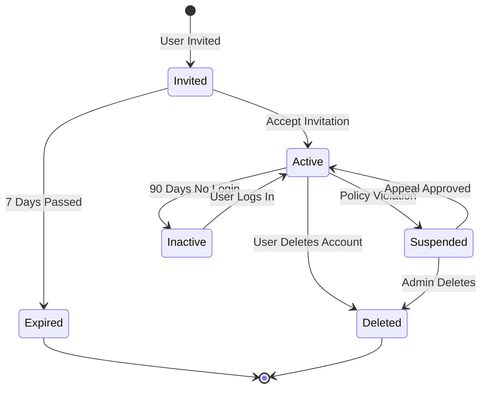

## Deployment Diagrams

### CI/CD Pipeline

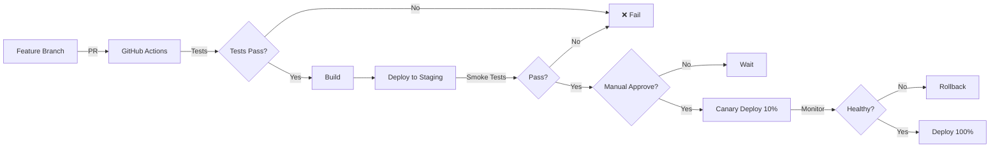

### Multi-Region Deployment

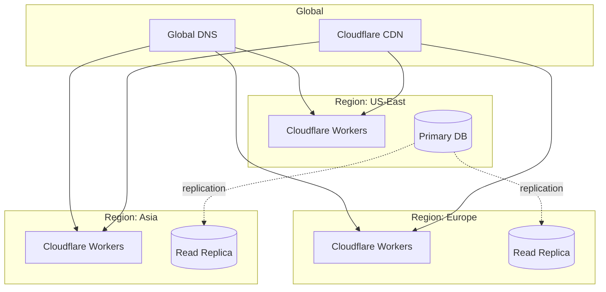

## Class Diagrams (TypeScript/Python)

### Service Architecture

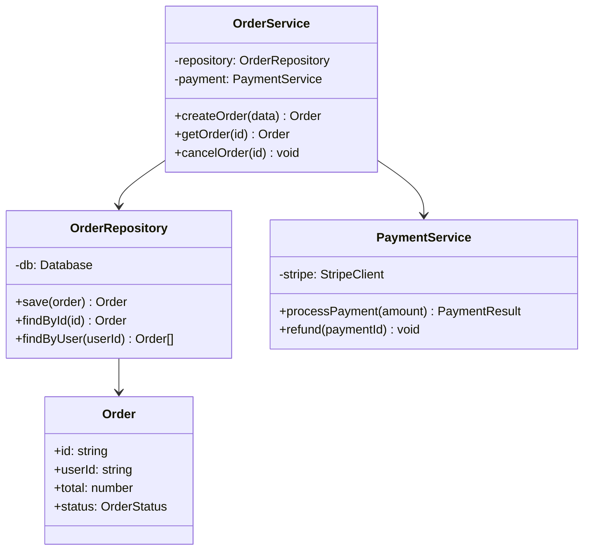

## Best Practices

1. **Keep Diagrams Simple**: One concept per diagram
2. **Use Subgraphs**: Group related components
3. **Consistent Naming**: Use same names as code
4. **Color Coding**: Use colors sparingly for emphasis
5. **Labels**: Add descriptive labels to edges
6. **Legend**: Include legend for complex diagrams
7. **Direction**: LR (left-right) or TB (top-bottom) based on flow
8. **Update Regularly**: Keep in sync with code changes

## Rendering in Documentation

### GitHub Markdown

````markdown
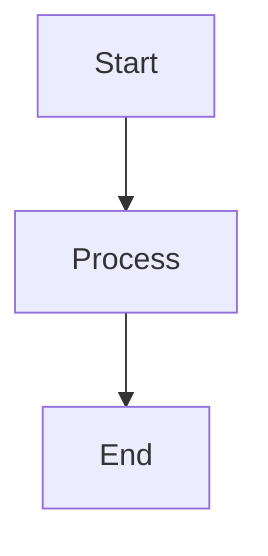
````

### Docusaurus

Install plugin:
```bash
npm install @docusaurus/theme-mermaid
```

### MkDocs

Install plugin:
```bash
pip install mkdocs-mermaid2-plugin
```

## Common Patterns

### Request/Response Flow
Use sequence diagrams with alt/opt for error handling

### Data Relationships
Use ER diagrams with proper cardinality (||--o{)

### State Transitions
Use state diagrams for order status, user lifecycle

### System Overview
---

Related: [openapi-patterns.md](openapi-patterns.md) | [documentation-standards.md](documentation-standards.md) | [Return to INDEX](INDEX.md)
