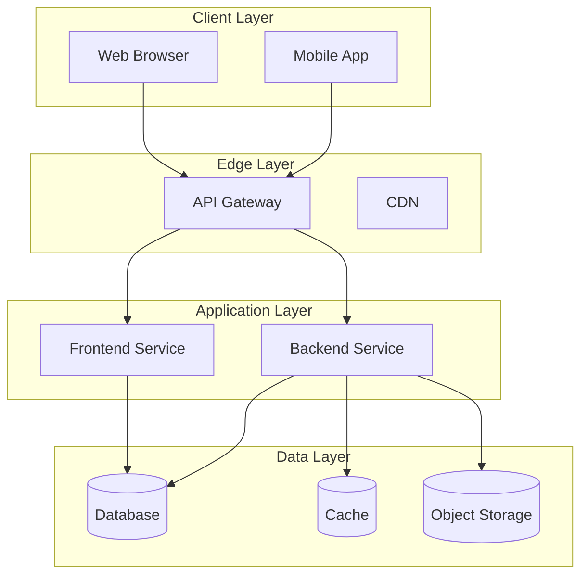
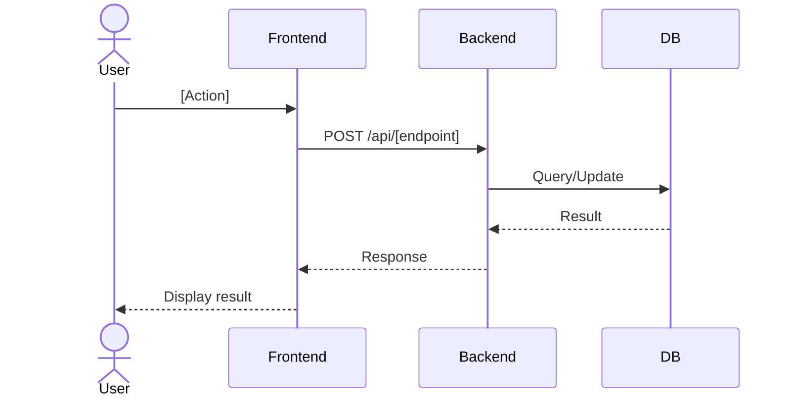
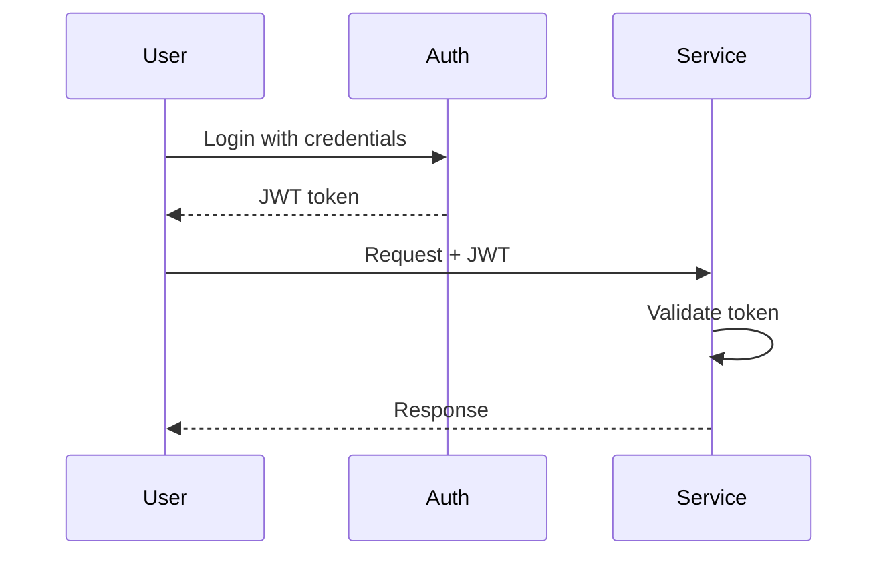
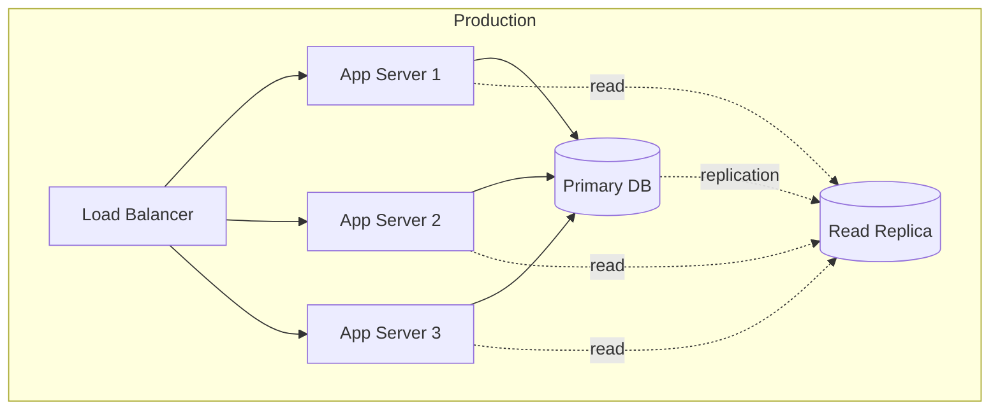
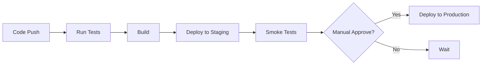

# [System Name] Architecture

**Version**: [1.0.0]
**Last Updated**: [YYYY-MM-DD]
**Status**: [Draft / In Review / Approved]
**Authors**: [Names]

## Executive Summary

[2-3 paragraph high-level overview suitable for non-technical stakeholders. Include:]
- What the system does
- Key business value
- Major technical decisions
- Scale/performance characteristics

## Table of Contents

- [System Overview](#system-overview)
- [Architecture Overview](#architecture-overview)
- [Core Components](#core-components)
- [Data Flow](#data-flow)
- [Integration Points](#integration-points)
- [Security Model](#security-model)
- [Deployment Architecture](#deployment-architecture)
- [Architecture Decision Records](#architecture-decision-records)
- [Appendix](#appendix)

## System Overview

### Purpose

[What problem does this system solve?]

### Key Features

- **Feature 1**: [Description]
- **Feature 2**: [Description]
- **Feature 3**: [Description]

### Non-Functional Requirements

| Requirement | Target | Current |
|-------------|--------|---------|
| Availability | 99.9% | 99.95% |
| Response Time (p95) | <500ms | 320ms |
| Throughput | 1000 req/s | 850 req/s |
| Data Retention | 7 years | 7 years |

## Architecture Overview

### High-Level Architecture

### Technology Stack

| Layer | Technology | Version | Rationale |
|-------|------------|---------|-----------|
| Frontend | [Framework] | [x.y.z] | [Why chosen] |
| Backend | [Framework] | [x.y.z] | [Why chosen] |
| Database | [Database] | [x.y.z] | [Why chosen] |
| Cache | [Cache] | [x.y.z] | [Why chosen] |
| Deployment | [Platform] | [x.y.z] | [Why chosen] |

## Core Components

### [Component 1]: [Name]

**Purpose**: [What this component does]

**Responsibilities**:
- [Responsibility 1]
- [Responsibility 2]
- [Responsibility 3]

**Technology**: [Framework/Language]
**Repository**: [Link to repo]

**Key Interfaces**:
- REST API: `POST /api/v1/[endpoint]`
- WebSocket: `wss://[domain]/[path]`
- Message Queue: `[queue-name]`

### [Component 2]: [Name]

[Same structure as Component 1]

## Data Flow

### [Flow 1]: [Name]

**Steps**:
1. [Step 1 description]
2. [Step 2 description]
3. [Step 3 description]

**Error Handling**:
- [Error scenario 1]: [How handled]
- [Error scenario 2]: [How handled]

## Integration Points

### External Service 1: [Service Name]

**Purpose**: [Why we integrate with this service]
**Protocol**: [REST API / GraphQL / gRPC]
**Authentication**: [Method]
**Rate Limits**: [X requests per Y]
**SLA**: [Uptime guarantee]

**Endpoints Used**:
- `[METHOD] /[path]` - [Purpose]
- `[METHOD] /[path]` - [Purpose]

**Fallback Strategy**: [What happens if service unavailable]

### External Service 2: [Service Name]

[Same structure as External Service 1]

## Security Model

### Authentication

**Method**: [JWT / OAuth2 / API Key]

### Authorization

**Model**: [RBAC / ABAC / ACL]

**Roles**:
- `admin`: [Permissions]
- `member`: [Permissions]
- `guest`: [Permissions]

### Data Protection

**Encryption**:
- At rest: [Method, algorithm]
- In transit: TLS 1.3
- Database: [Encryption method]

**Multi-Tenancy**:
- Isolation method: [Row-Level Security / Separate DBs / Separate Schemas]
- Tenant identification: [Header / Subdomain / Path]

## Deployment Architecture

### Environments

| Environment | Purpose | URL | Auto-Deploy |
|-------------|---------|-----|-------------|
| Development | Feature development | https://dev.[domain] | On PR |
| Staging | Pre-production testing | https://staging.[domain] | On merge to main |
| Production | Live system | https://[domain] | On release tag |

### Infrastructure

**Resources**:
- App Servers: [X instances, Y CPU, Z GB RAM]
- Database: [Specifications]
- Cache: [Specifications]

### CI/CD Pipeline

## Architecture Decision Records

### ADR-001: [Decision Title]

**Date**: [YYYY-MM-DD]
**Status**: [Accepted / Superseded / Deprecated]
**Decision Makers**: [Names]

**Context**: [What circumstances led to this decision?]

**Decision**: [What was decided?]

**Alternatives Considered**:
1. **[Option 1]**: [Pros/Cons]
2. **[Option 2]**: [Pros/Cons]

**Consequences**:
- **Positive**: [Benefit 1], [Benefit 2]
- **Negative**: [Trade-off 1], [Trade-off 2]

**Implementation**: [How was this implemented?]

### ADR-002: [Decision Title]

[Same structure as ADR-001]

## Appendix

### Glossary

| Term | Definition |
|------|------------|
| [Term] | [Definition] |

### References

- Architecture Diagrams: [Link]
- API Documentation: [Link]
- Runbooks: [Link]
- Monitoring Dashboard: [Link]

### Related Documentation

- [Link to related doc 1]
- [Link to related doc 2]

---

[Return to Documentation Index](../README.md)
