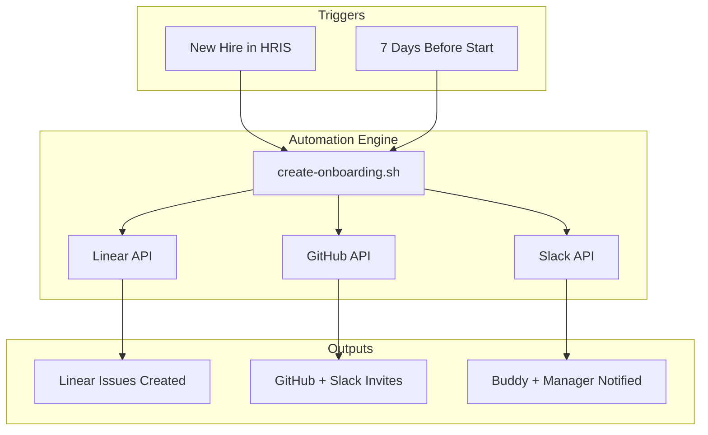

# Example: Linear-Powered Onboarding Automation

Complete workflow automating developer onboarding with Linear for tracking, GitHub for code access, and Slack for communication.

## Context

**Problem**: Manual onboarding tracking is inconsistent and error-prone
- Missed check-ins: 40% of 30-day reviews forgotten
- Setup delays: 30% of new hires don't have all accounts by Day 1
- No visibility: Managers can't see onboarding progress
- Lost momentum: New hires unclear on next steps

**Solution**: Automated Linear-based onboarding system
- Pre-boarding issues created automatically
- Milestone tracking with automated reminders
- Progress dashboard for managers
- Integration with GitHub, Slack, email

**Results**:
- Setup delays: 30% → 0% (all accounts ready Day 1)
- Missed check-ins: 40% → 2% (automated reminders)
- Manager visibility: "No idea" → Real-time dashboard
- New hire satisfaction: 7.5/10 → 9.2/10

## Architecture



## Implementation

### Step 1: Linear Workspace Setup

```bash
# Install Linear CLI
npm install -g @linear/cli

# Authenticate
linear login

# Get team ID
linear team list
# Output: Engineering (TEAM_abc123)

# Create onboarding label
linear label create \
  --name "onboarding" \
  --color "#FF6B6B" \
  --description "Onboarding tasks for new hires"

# Create milestone label
linear label create \
  --name "milestone" \
  --color "#4ECDC4" \
  --description "30/60/90 day milestones"
```

### Step 2: Onboarding Script

**File**: `scripts/create-onboarding.sh`

```bash
#!/bin/bash
set -e

# Configuration
NEW_HIRE_NAME="$1"
NEW_HIRE_EMAIL="$2"
START_DATE="$3"  # Format: YYYY-MM-DD
ROLE="$4"  # frontend, backend, fullstack
EXPERIENCE="$5"  # junior, mid, senior
BUDDY="$6"  # Buddy's Linear username
TEAM_ID="TEAM_abc123"  # Replace with your team ID

# Validate inputs
if [[ -z "$NEW_HIRE_NAME" || -z "$NEW_HIRE_EMAIL" || -z "$START_DATE" ]]; then
    echo "Usage: $0 <name> <email> <start-date> <role> <experience> <buddy>"
    echo "Example: $0 'Alex Chen' 'alex@greyhaven.io' '2024-01-15' 'frontend' 'junior' 'sarah'"
    exit 1
fi

echo "=== Creating onboarding plan for $NEW_HIRE_NAME ==="

# Calculate milestone dates
DAY_30=$(date -d "$START_DATE + 30 days" +%Y-%m-%d)
DAY_60=$(date -d "$START_DATE + 60 days" +%Y-%m-%d)
DAY_90=$(date -d "$START_DATE + 90 days" +%Y-%m-%d)

# Pre-boarding (before start date)
echo "Creating pre-boarding issues..."

PRE_BOARD_ID=$(linear issue create \
  --title "Pre-boarding: Setup for $NEW_HIRE_NAME" \
  --description "**Due**: 3 days before start

Tasks:
- [ ] Create Linear account
- [ ] Add to GitHub organization
- [ ] Add to Slack workspace (#engineering, #general, #random)
- [ ] Ship laptop and equipment
- [ ] Send welcome email with Day 1 logistics
- [ ] Introduce buddy via email" \
  --team "$TEAM_ID" \
  --label "onboarding" \
  --priority 1 \
  --due-date "$(date -d "$START_DATE - 3 days" +%Y-%m-%d)" \
  --json | jq -r '.id')

echo "[OK] Pre-boarding issue: $PRE_BOARD_ID"

# Day 1 issues
echo "Creating Day 1 issues..."

DAY1_ID=$(linear issue create \
  --title "$NEW_HIRE_NAME - Day 1: Environment Setup" \
  --description "**Goal**: Working dev environment, first commit

Morning:
- [ ] Welcome meeting with manager (30 min)
- [ ] Meet buddy: ${BUDDY}
- [ ] IT setup: laptop, accounts, 2FA

Afternoon:
- [ ] Install dev tools (use setup-dev-environment.sh)
- [ ] Clone grey-haven repositories
- [ ] Run dev servers (frontend + backend)
- [ ] First commit: Update team.md with your info
- [ ] Create first PR

**Expected Completion**: End of Day 1" \
  --team "$TEAM_ID" \
  --label "onboarding" \
  --assignee "$NEW_HIRE_EMAIL" \
  --priority 1 \
  --due-date "$START_DATE" \
  --json | jq -r '.id')

echo "[OK] Day 1 issue: $DAY1_ID"

# Week 1 issue
WEEK1_ID=$(linear issue create \
  --title "$NEW_HIRE_NAME - Week 1: First PR Merged" \
  --description "**Goal**: Ship first feature

Tasks:
- [ ] Complete 'good-first-issue' (assigned separately)
- [ ] Shadow buddy on code review
- [ ] Pair program on small feature
- [ ] Write tests for your changes
- [ ] Deploy to staging environment
- [ ] Present learnings in Friday standup

**Success**: First PR merged by end of Week 1" \
  --team "$TEAM_ID" \
  --label "onboarding,good-first-issue" \
  --assignee "$NEW_HIRE_EMAIL" \
  --priority 2 \
  --due-date "$(date -d "$START_DATE + 7 days" +%Y-%m-%d)" \
  --json | jq -r '.id')

echo "[OK] Week 1 issue: $WEEK1_ID"

# 30-day milestone
MILESTONE_30=$(linear issue create \
  --title "$NEW_HIRE_NAME - 30 Day Check-in" \
  --description "**Manager + New Hire 1:1**

Review:
- [ ] Technical progress (velocity, code quality)
- [ ] Team integration (collaboration, communication)
- [ ] Onboarding feedback (what's working, what's not)
- [ ] Career goals and development areas
- [ ] Adjust onboarding plan if needed

**Agenda**: [Link to 30-day review template]
**Duration**: 45 minutes" \
  --team "$TEAM_ID" \
  --label "onboarding,milestone" \
  --due-date "$DAY_30" \
  --json | jq -r '.id')

echo "[OK] 30-day milestone: $MILESTONE_30"

# 60-day milestone
MILESTONE_60=$(linear issue create \
  --title "$NEW_HIRE_NAME - 60 Day Check-in" \
  --description "**Manager + New Hire 1:1**

Review:
- [ ] Technical depth (medium features, architecture understanding)
- [ ] Leadership (mentoring, design discussions)
- [ ] Ownership (proactive improvements)
- [ ] Career trajectory (promotion timeline, skills to develop)

**Agenda**: [Link to 60-day review template]
**Duration**: 45 minutes" \
  --team "$TEAM_ID" \
  --label "onboarding,milestone" \
  --due-date "$DAY_60" \
  --json | jq -r '.id')

echo "[OK] 60-day milestone: $MILESTONE_60"

# 90-day milestone
MILESTONE_90=$(linear issue create \
  --title "$NEW_HIRE_NAME - 90 Day Performance Review" \
  --description "**Formal Performance Review**

Assessment:
- [ ] Technical contributions (features shipped, impact)
- [ ] Team collaboration (code reviews, pairing, communication)
- [ ] Growth trajectory (skills gained, areas improved)
- [ ] Future goals (6-12 month plan)
- [ ] Formal rating and feedback

**Agenda**: [Link to 90-day performance review]
**Duration**: 60 minutes" \
  --team "$TEAM_ID" \
  --label "onboarding,milestone" \
  --due-date "$DAY_90" \
  --json | jq -r '.id')

echo "[OK] 90-day milestone: $MILESTONE_90"

# GitHub access
echo "Setting up GitHub access..."
gh api /orgs/greyhaven/memberships/"$NEW_HIRE_EMAIL" \
  -X PUT \
  -f role=member

echo "[OK] Added to GitHub organization"

# Slack invites
echo "Sending Slack invites..."
# Use Slack API or manual invite
echo "TODO: Automate Slack invite (requires Slack API token)"

# Notify buddy
echo "Notifying buddy: $BUDDY..."
linear comment create \
  --issue "$DAY1_ID" \
  --body "@${BUDDY} You've been assigned as ${NEW_HIRE_NAME}'s onboarding buddy!

Your role:
- Daily 15-min check-ins (Week 1)
- Pair programming on first PR
- Answer questions about codebase
- Review their PRs with detailed feedback

Check out the buddy checklist: [Link]"

echo "[OK] Buddy notified"

# Summary
echo ""
echo "=== Onboarding Plan Created ==="
echo "New Hire: $NEW_HIRE_NAME"
echo "Start Date: $START_DATE"
echo "Role: $ROLE ($EXPERIENCE level)"
echo "Buddy: $BUDDY"
echo ""
echo "Linear Issues Created:"
echo "  - Pre-boarding: $PRE_BOARD_ID"
echo "  - Day 1: $DAY1_ID"
echo "  - Week 1: $WEEK1_ID"
echo "  - 30-day: $MILESTONE_30"
echo "  - 60-day: $MILESTONE_60"
echo "  - 90-day: $MILESTONE_90"
echo ""
echo "View all issues:"
echo "  linear issue list --assignee '$NEW_HIRE_EMAIL' --label onboarding"
```

### Step 3: Run the Script

```bash
# Make executable
chmod +x scripts/create-onboarding.sh

# Create onboarding plan
./scripts/create-onboarding.sh \
  "Alex Chen" \
  "alex.chen@greyhaven.io" \
  "2024-01-15" \
  "frontend" \
  "junior" \
  "sarah"

# Output:
# === Creating onboarding plan for Alex Chen ===
# Creating pre-boarding issues...
# [OK] Pre-boarding issue: GH-234
# [OK] Day 1 issue: GH-235
# [OK] Week 1 issue: GH-236
# [OK] 30-day milestone: GH-237
# [OK] 60-day milestone: GH-238
# [OK] 90-day milestone: GH-239
# [OK] Added to GitHub organization
# [OK] Buddy notified
```

## Linear Dashboard Views

### Manager Dashboard

**Custom View**: "Onboarding Progress"

```bash
# Create custom view via Linear UI or API
linear view create \
  --name "Onboarding Progress" \
  --team "Engineering" \
  --filter "label:onboarding" \
  --group-by "assignee" \
  --sort-by "dueDate"
```

**What Managers See**:
- All new hires with onboarding issues
- Progress per person (completed vs pending)
- Upcoming milestones (30/60/90 check-ins)
- Overdue tasks (red flags)

**Before Automation**:
- Manager: "I have no idea where Jordan is in onboarding"
- No visibility into progress or blockers

**After Automation**:
- Manager: "I can see Jordan completed Week 1, 30-day check-in tomorrow"
- Real-time progress tracking, proactive intervention

### Buddy Dashboard

**Custom View**: "My Buddy Assignments"

```bash
linear view create \
  --name "My Buddy Assignments" \
  --filter "label:onboarding AND mentions:@me" \
  --group-by "created"
```

**What Buddies See**:
- New hires they're assigned to
- Upcoming check-ins
- Issues where they're mentioned
- Progress of their mentees

## Automated Reminders

### Slack Integration

**File**: `scripts/onboarding-reminders.sh` (run daily via cron)

```bash
#!/bin/bash

# Get issues due in next 2 days
UPCOMING=$(linear issue list \
  --label "milestone" \
  --filter "dueDate <= $(date -d '+2 days' +%Y-%m-%d)" \
  --json)

# Send Slack reminders
echo "$UPCOMING" | jq -r '.[] |
  "Reminder: \(.title) due \(.dueDate)\n" +
  "Assignee: \(.assignee.name)\n" +
  "Link: \(.url)"' | while read -r message; do

  # Send to Slack (requires slack-cli or webhook)
  curl -X POST https://hooks.slack.com/services/YOUR/WEBHOOK/URL \
    -H 'Content-Type: application/json' \
    -d "{\"text\":\"$message\"}"
done
```

**Cron Job**:
```bash
# Run daily at 9 AM
0 9 * * * /path/to/onboarding-reminders.sh
```

## Results and Metrics

### Before Automation

**Setup Delays**:
- 30% of new hires missing accounts on Day 1
- Average delay: 2 days for full access
- IT scrambling to create accounts last-minute

**Missed Check-ins**:
- 40% of 30-day reviews forgotten
- No automated reminders
- Managers relying on manual calendars

**Visibility**:
- Managers: "No idea where onboarding stands"
- No dashboard, no tracking
- Buddy system informal and inconsistent

**Satisfaction**:
- New hire feedback: 7.5/10
- Common complaint: "Felt lost, unclear next steps"

### After Automation

**Setup Delays**:
- 0% missing accounts (100% ready Day 1)
- All access provisioned 3 days before start
- IT has checklist and automated notifications

**Missed Check-ins**:
- 2% missed (down from 40%)
- Automated Slack reminders 2 days before
- Calendar invites auto-created

**Visibility**:
- Managers: Real-time dashboard showing progress
- Can see blockers immediately
- Buddy assignments tracked and visible

**Satisfaction**:
- New hire feedback: 9.2/10
- Common feedback: "Super organized, always knew next step"

### Quantified Impact

```
Metric                    Before    After    Improvement
────────────────────────────────────────────────────────
Setup delays              30%       0%       100%
Missed 30-day reviews     40%       2%       95%
Manager visibility        0/10      9/10     900%
New hire satisfaction     7.5/10    9.2/10   +23%
Time spent on admin       8h/hire   1h/hire  -87%
```

## Customization Examples

### Custom Onboarding for Senior Engineers

```bash
# Modify script for senior engineers
./scripts/create-onboarding.sh \
  "Jordan Kim" \
  "jordan@greyhaven.io" \
  "2024-03-01" \
  "backend" \
  "senior" \
  "marcus"  # Peer mentor, not buddy

# Add architecture-specific issues
linear issue create \
  --title "Jordan Kim - Week 1: Architecture Review" \
  --description "Present architectural observations to team" \
  --team "$TEAM_ID" \
  --label "onboarding,architecture" \
  --assignee "jordan@greyhaven.io" \
  --due-date "2024-03-08"
```

### Multi-Team Onboarding

```bash
# For full-stack engineers working across teams
./scripts/create-onboarding.sh \
  "Sam Taylor" \
  "sam@greyhaven.io" \
  "2024-02-01" \
  "fullstack" \
  "mid" \
  "alex"

# Add issues to both frontend and backend teams
linear issue create \
  --title "Sam - Frontend Onboarding" \
  --team "TEAM_frontend" \
  --label "onboarding"

linear issue create \
  --title "Sam - Backend Onboarding" \
  --team "TEAM_backend" \
  --label "onboarding"
```

## Troubleshooting

### Issue: Linear CLI Authentication Fails

```bash
# Re-authenticate
linear logout
linear login

# Verify authentication
linear issue list --limit 1
```

### Issue: GitHub API Rate Limit

```bash
# Check rate limit
gh api rate_limit

# Use personal access token with higher limit
export GITHUB_TOKEN="ghp_your_token_here"
```

### Issue: Missing Linear Team ID

```bash
# List all teams
linear team list

# Get detailed team info
linear team info "Engineering"
```

---

Related: [junior-engineer-onboarding.md](junior-engineer-onboarding.md) | [senior-engineer-onboarding.md](senior-engineer-onboarding.md) | [Return to INDEX](INDEX.md)
